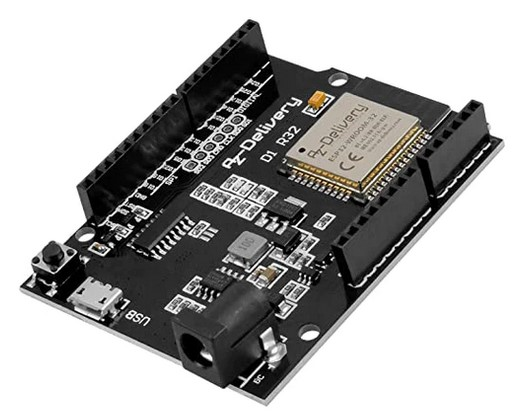
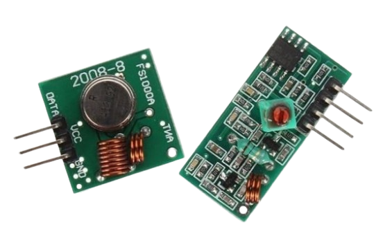

# tp-gestionIO

**Objectifs :** 	On désire faire communiquer un ESP32 avec un capteur d'humidité et de température, et un autre ESP32 via une communication sans fil et un affichage sur Node Red.

---

## Nomenclature

- Deux carte Az-Delivery [D1 R32](https://www.az-delivery.de/fr/products/esp32-d1-r32-board)



- Un [module RF](https://www.twinschip.com/RF_Wireless_433Mhz) émission et réception 433Mz 

---

Cette activité est à réaliser avec **PlatformIO** pour une carte ESP32 avec le _framework_ **Arduino**.

Le fichier de projet `platformio.ini` :

```ini
[env:esp32dev]
platform = espressif32
board = esp32dev
framework = arduino
lib_deps =
  # RECOMMENDED
  # Accept new functionality in a backwards compatible manner and patches
  adafruit/DHT sensor library @ ^1.4.6

  # Accept only backwards compatible bug fixes
  # (any version with the same major and minor versions, and an equal or greater patch version)
  adafruit/DHT sensor library @ ~1.4.6

  # The exact version
  adafruit/DHT sensor library @ 1.4.6
```
Le fichier `src/main.cpp` initial :

```cpp

/**     // TO DO
 * @file main.cpp
 * @author your name
 * @brief 
 * @version 0.1
 * @date 2024-11-22
 * 
 * @copyright Copyright (c) 2024
 * 
 */
//////////////////////////////////////////////////////////////////////

#include <Arduino.h>

//////////////////////////////////////////////////////////////////////
void setup() {
   // TO DO
 }
//////////////////////////////////////////////////////////////////////
void loop() {
  // TO DO
}

```

&copy; 2024 LICENCE SN-DOC Lasalle Avignon - B.MICHEL

